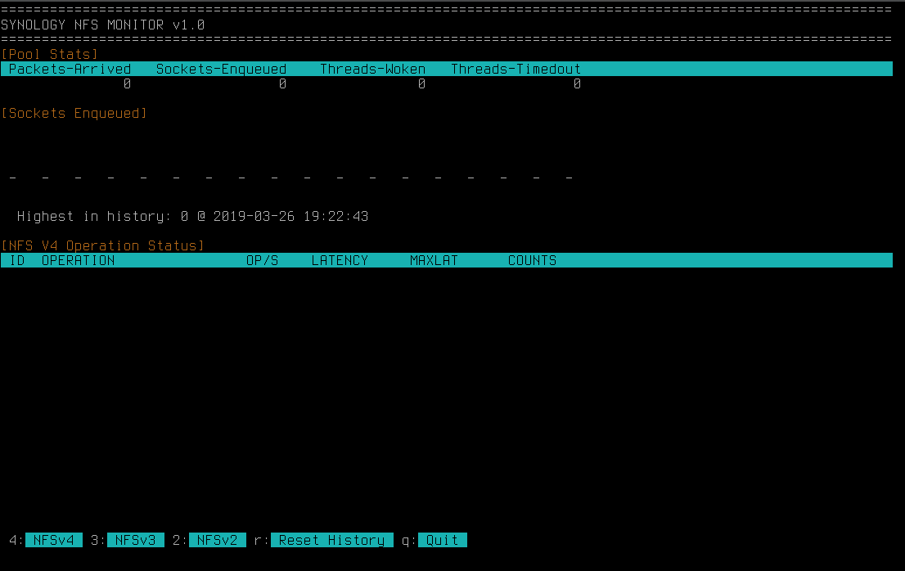
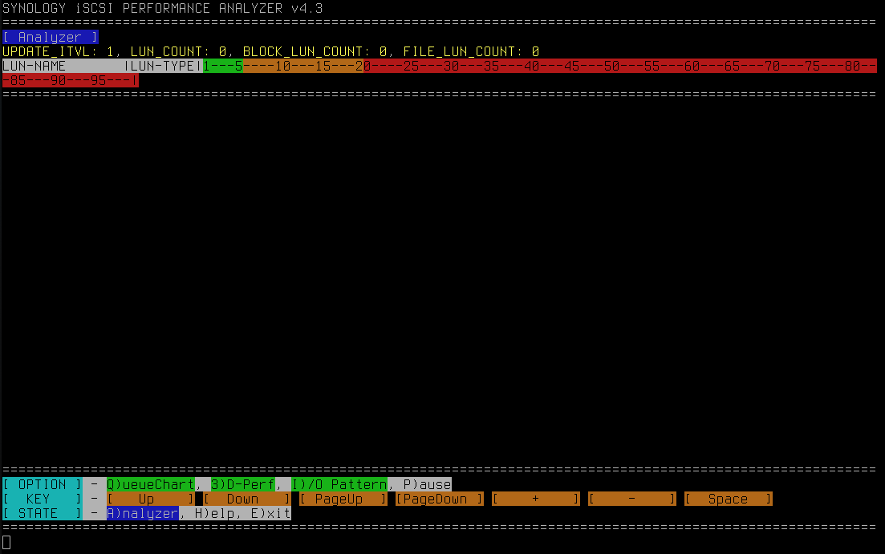

# SYNOLOGY

##### **All** scripts that will be made by wuseman is licensed under GPL Version 3 under this repository, feel free to share the cheatsheet anywhere & anytime

##### A notice to all nerds. If you will copy the wiki and steal the real developers work will not make you a hacker.

#### Be careful, some commands may wipe DATA so read carefully please.

##### Install various packages on your Synology NAS via OPKG (script can be found [here](https://github.com/wuseman/SYNOLOGY/blob/master/scripts/wsynopkg.sh))

# CHEATSHEET

#### Print workgroup for NAS:

     synowin -getWorkgroup
     
#### Join a new workgroup for NAS:

     synowin -joinWorkgroup <group>

#### Print general info:

      synoservice --status

#### Setup mail via cli:

      synosyslogmail

#### Check upgrades:

      synoupgrade --check 3

#### Dump data about your nas:

     syno_system_dump

#### Print network info incl. current duplex:

     synonet --show
     
#### Print current hostname:

     synonet --get_hostname
     
#### Set a new hostname: 

    synonet --set_hostname
     
#### Set a new gateway:

    synonet --set_gateway gateway
    
#### WOL Wakeup:

    synonet --wake xx:xx:xx:xx:xx:xx <interface>

#### Print the partition layout table.

    synopartition --list
    
## Sharing

##### Print info about a share:

    synoshare --get <sharefolder>

##### Mount an shared encrypted folder:

    synoshare --enc_mount <sharefolder> <password>

##### Unmount an encrypted folder:

    synoshare --enc_unmount <sharefolder>

##### Allowed to delete:

    synoshare --del {TRUE|FALSE} sharename1 sharename2 ... 
    
##### Set an description for a shared folder (viewed in comments in file browser)

    synoshare --setdesc sharename desc

###### Allow browsing of shared folder

    synoshare --setbrowse sharename browse_flag{0|1} 
    
##### Rename a shared folder:

    synoshare --rename  old_sharename new_sharename
    
##### Set users that is allowed to browse shared folder:

    synoshare --setuser sharename user_auth{NA|RO|RW} operator{+|-|=} user_name_list_with_comma

### User

####  Print main data about a user

    sh-4.3# synouser --get wuseman
    User Name   : [wuseman]
    User Type   : [AUTH_LOCAL]
    User uid    : [1026]
    Primary gid : [100]
    Fullname    : []
    User Dir    : [/var/services/homes/wuseman]
    User Shell  : [/bin/sh]
    Expired     : [false]
    User Mail   : []
    Alloc Size  : [82]
    Member Of   : [2]
    (100) users
    (101) administrators
    
#### Set a new password/Change password:

    synouser --setpw oldpassword newpassword

#### Rename a user:

    synouser --rename old_username new_username
    
#### Add a username with full info:

    synouser --add [username pwd "full name" expired{0|1} mail privilege]

## Notifications:
    
### Send an email about storage:    

    synostorage --mail
  
#### Lock managment

    synostorage --lock

## Tuning functionality:
  
##### Get current tuning profile:

    synotune --get   
    Outut: Current Profile: performance_throughput
    
#### Set a new functionality, options:

    synotune --set    performance_throughput OR performance_latency
    
#### Dump info about your synology nas:

    syno_system_dump
    
## Upgrade

##### Set your nas to handle upgrades auto:

    synoupgrade --auto
    
##### Check your current upgrade settings:

    synoupgrade --check

##### Download latest upgrade if there is a new one:

    synoupgrade --download 
   
##### Start upgrade:

    synoupgrade --start
    
#### Check the partition layout table:

    synopartition --check /dev/sd<X>
 
#### View synology NFS Monitor:

   synonfstop
   

    

#### Reset your Synology NAS (Settings Only)

     /usr/syno/sbin/./synodsdefault --reset

#### Reset your Synology Nas to Factory Default (OBS OBS OBS ALL DATA WILL BE WIPED)

     /usr/syno/sbin/./synodsdefault --factory-default

#### Reinstall your Synology Nas Station, all data will be kept:

     /usr/syno/sbin/./synodsdefault --reinstall; reboot

#### The proper way to restart SSHD of your NAS via cli:

     synoservicectl --restart sshd

#### List, uninstall or install a .spk package file (available locally)

      synopkg

#### Install a set a networking and ELF binary debugging tools (and drop into a root session)

     synogear

#### Write and read an .ini style file with lines of key=value pairs

     synosetkeyvalue
     synogetkeyvalue

#### Shut down and power off the NAS (much like shutdown -h now)

     synopoweroff

#### Show installed packages

     synopkg list | sed 's/: .*$//' 

#### Uninstall a package

     sudo synopkg uninstall 

#### Synology Shutdown and Poweroff Too

     syno_poweroff_task

#### Set/establish password to local user

     synoauth local_username password

#### Manage IP autoblock feature

     synoautoblock OPTIONS 

#### Manage blog feature

     synoblog_backup [-r|-b] p [-u username] [-o]

#### Synology disk control device: something like /dev/hda or /dev/sda

     syno_disk_ctl OPTIONS DEVICE  

#### Synology clear .tbd-File Tool

     SYNOClearTdb FILE 

#### Different ways to print various info about your NAS

     more /etc.defaults/VERSION 
     cat /etc/synoinfo.conf
     cat /proc/cmdline
     synoshare --enum ALL 
     synonet --show 
     synodisk --enum 
     synospace --enum -a 

#### Restart index

     synoservicectl --restart synoindexd

#### Check for upgrades

     sudo synoupgrade --check

#### Restart webserver

     /usr/syno/sbin/synoservicecfg --restart httpd-user 
     /usr/syno/sbin/synoservicectl --restart pkgctl-WebStation

#### Generate a list for what you can control

     /usr/syno/sbin/synoservice --list

#### DSM API - Provide DSM information

     syno dsm getInfo --pretty 

#### File Station API - Provide File Station information

     syno fs getInfo --pretty 

#### File Station API - Enumerate files in a given folder

     syno fs listFiles --payload '{"folder_path":"/path/to/folder"}' --pretty 

#### Download Station API - List download tasks

     syno dl listFiles --payload '{"limit":5, "offset":10}' --pretty 

#### Download Station API - Create a download task

     syno dl createTask --payload '{"uri":"https://link"}'

#### Audio Station API - Search a song

     syno as searchSong --payload '{"title":"my_title_song"}' --pretty

#### Video Station API - List movies

     syno vs listMovies --payload '{"limit":5}' --pretty

#### Video Station DTV API - List channels

     syno dtv listChannels --payload '{"limit":1}' --pretty 

#### Surveillance Station API - Get camera information

     syno ss getInfoCamera --payload '{"cameraIds":8}' --pretty 

#### Restart, enable, stop samba

     /usr/syno/etc/rc.sysv/S80samba.sh --help

#### Get synology date

     synodate --getSysDate

#### Printer stuff

    synoprint

#### Update index older

    indexfolder --type={SHARE_CREATE|SHARE_REMOVE} --share=<SHARED_FOLDER> --share_path=<SHARED_FOLDER>

#### Start mediaserver

    /usr/syno/bin/mediaserver.sh start

#### CAREFUL, KILLING NAS

    servicetool --get-service-volume download 

#### Get 2FA key if lost

    ssh root@nas cat /usr/syno/etc/preference/wuseman/google_authenticator

#### List disk info on a very fancy way

    dhm_tool -s 

## Synology Autoblock

#### I have seen many threads on synology forum about this topic, DON'T touch the DB file if you really don't need, use synoautoblock command instead, see examples below:

#### Add a IP to autoblock db:

    synoautoblock --deny <ip-address>
    
#### Reset a IP that has been added by mistake:

    synoautoblock --reset <ip-address>
    
#### Add any IP to whitelist:

    synoautoblock --in-white-list <ip-address>
   
## Debugging & System Health:

#### Debug fans and email the result (if email has been set)

    syno_fan_debug
    
#### Run a health check of your system and email the the result once done:

    syno_disk_health_record
    
#### Check ~remain lifetime:

    syno_disk_remain_life_check
    
#### Run smartmontools and send email once done:

    syno_disk_smart_mail_send
    
#### Debug hibernation: 

    syno_hibernation_debug
   
## LED (Get min and max value in: /usr/syno/etc.defaults/led_brightness.xml)

##### Get current setup:

    syno_led_brightness --get (Default on DS416: 1985157252)
    
##### Set a new setting:

    syno_led_brightness --set <brightness> 
    
## Bandwidth

##### Print a user bandwidth usage:

    synobandwidth --status [<list=user|group|all(default)> <transfer=upload|download|all(default)>] <merge=0|1(default)>]
    
##### Set a new bandwidth limit for a user:

    synobandwidth --set-global-conf <state=enabled|disabled> [<protocol=filestation|webdav|ftp|rsync|all(default)>

##### Print status user by user for all services:

     sh-4.3# synobandwidth --preview wuseman
        Protocol     Upload   Download
        filestation  0.00       0.00
        webdav       0.00       0.00
        ftp          0.00       0.00
        rsync        0.00       0.00

## ISCI

### Synology iSCSI Perfomance Analyzer

    synoiscsitop40
    

## Fan

## Set fan config (loudest will sound like an airplane)

     synofanconfig -parseXML 1000000

## More synology commands listed:

     sync
     synologconvert
     syno-dbus-check.sh
     synologrotated
     syno-letsencrypt
     synologset
     syno-move-coredump
     synologset1
     syno8021Xtool
     synolunbackup
     synoRTCTime
     synolunbkp
     syno_adv_test
     synoluntransform
     syno_dc_ctrl_adapter.sh
     synomediaparserd
     syno_disk_config_check
     synomkflv
     syno_disk_ctl
     synomkflvd
     syno_disk_data_collector
     synomkthumb
     syno_disk_db_update
     synomkthumbd
     syno_disk_dsl
     synomoduletool
     syno_disk_health_record
     synomount
     syno_disk_information_daily_record
     synomustache
     syno_disk_log_convert
     synomyds
     syno_disk_log_import_from_xml
     synonclient_send
     syno_disk_remain_life_check
     synonet
     syno_disk_smart_mail_send
     synonetd
     syno_disk_test_log_import_from_xml
     synonetdtool
     syno_disk_test_scheduler_set
     synonetseqadj
     syno_disk_testlog_convert
     synonfstop
     syno_disk_wcache_config_init
     synonotify
     syno_dvb_admin.sh
     synootp
     syno_fan_debug
     synoovstool
     syno_hdd_util
     synopartition
     syno_hibernation_debug
     synopasswordmail
     syno_hw_video_transcoding.sh
     synopayment
     syno_iptables_common
     synoperfeventd
     syno_led_brightness
     synoperformancediagnose
     syno_mem_check
     synopftest
     syno_pkgicon_sprite.py
     synophoto_acl
     syno_poweroff_task
     synophoto_acl_pgsql
     syno_scemd_connector
     synophoto_autoblock
     syno_smart_result_collect
     synophoto_backup
     syno_smart_test
     synophoto_config
     syno_ssd_trim
     synophoto_config_root
     syno_system_dump
     synophoto_dsm_user
     synoabnormalloginmail
     synophoto_external_access
     synoacltool
     synophoto_extract_preview
     synoagentregisterd
     synophoto_music
     synoappbkp
     synophoto_sdk_share_set
     synoappnotify
     synophoto_sns_utils
     synoapppriv_updater
     synophoto_update_db
     synoarchivetool
     synophoto_watermark_util
     synoauth
     synophotoio
     synoautoblock
     synopingpong
     synobackup
     synopkg
     synobackupd
     synopkgctl
     synobandwidth
     synopkghelper
     synoblog_backup
     synoplatform
     synobootseq
     synoportforward
     synobootupcheck
     synopoweroff
     synobtrfssnap
     synopreferencedir
     synocacheclient
     synoprint
     synocachepinfiletool
     synopsql
     synocachepinfiletool-status
     synoquota
     synocachepinfiletoolha
     synoraidtool
     synocerttool
     synorecycle
     synocfgen
     synorelayd
     synocgid
     synoretainer
     synocgitool
     synoretention-lun
     synocheckhotspare
     synoretentionconf
     synocheckiscsitrg
     synoretentiontest
     synochecknetworkcfg
     synoretentiontestutil.sh
     synocheckshare
     synorouterportfwd
     synocheckswapconfig
     synoroutertool
     synocloudserviceauth
     synorsyncdtool
     synocmsclient
     synosavetime
     synocodectool
     synoscgi
     synoconfbkp
     synoscgi________________________________________________________
     synoconfd
     synoschedtask
     synocontentextract
     synoschedtool
     synocontentextractd
     synoscimprofile
     synocopy
     synosdutils
     synocredential
     synosearch
     synocrond
     synosearchagent
     synocrtregister
     synoselfcheck
     synocrtunregister
     synoservice
     synodatacollect
     synoservicecfg
     synodataverifier
     synoservicectl
     synodate
     synoservicemigrate
     synodctest
     synosetkeyvalue
     synodd
     synoshare
     synoddnsinfo
     synosharequota
     synoddsmtool
     synosharesnapshot
     synodisk
     synosharesnaptool
     synodiskdatacollect
     synosharesnaptree
     synodiskfind
     synosharingbackup
     synodiskpathparse
     synosharingchecker
     synodiskport
     synosharingcron
     synodriveencode
     synosharingurl
     synodrivehook
     synosmartblock
     synodriveindex
     synosnapschedtask.sh
     synodriveobject
     synosnmpcd
     synodrivesettings
     synospace
     synodriveversion
     synospace.sh
     synodrivevolume
     synosshdutils
     synodsdefault
     synostgpool
     synodsinfo
     synostgsysraid
     synodsmnotify
     synostgvolume
     synoeaupgrade
     synostorage
     synoethinfo
     synostoragecore
     synoexternal
     synostoraged
     synofanconfig
     synosupportchannelchecker
     synofileutil
     synosyncdctime
     synofirewall
     synosyslogmail
     synofirewallUpdater
     synotc
     synoflashcache
     synotc_common
     synoflvconv
     synothumb
     synofstool
     synotifyd
     synogear
     synotifydutil
     synogetkeyvalue
     synotimecontrol
     synogpoclientd
     synotlstool
     synogrinst
     synotune
     synogroup
     synotunnelexec
     synoguest
     synoupgrade
     synohacore
     synoupnp
     synoindex
     synoups
     synoindex_mgr
     synoupscommon
     synoindex_package.sh
     synousbcam
     synoindexd
     synousbcopy
     synoindexplugind
     synousbdisk
     synoindexscand
     synousbmodemd
     synoindexworkerd
     synouser
     synoiscsiep
     synouserdir
     synoiscsihook
     synouserhome
     synoiscsitool
     synovolumesnapshot
     synoiscsitop
     synovpnc
     synoiscsitop40
     synovspace
     synoiscsiunmap
     synovspace_wrapper
     synoiscsiwebapi
     synow3
     synoisns
     synow3tool
     synokerneltz
     synowebapi
     synolanstatus
     synowifid
     synoldapclient
     synowin
     synoldapclientd
     synowireless
     synologaccd
     synowsdiscoveryd
     synologand
     synowstransferd
     synologanutil
     synozram
     synologconfgen
     
## REQUIREMENTS

Synology NAS Device
 
## CONTACT

If you have problems, questions, ideas or suggestions please contact me by posting to wuseman@nr1.nu

## WEB SITE

Visit my websites and profiles for the latest info and updated tools

https://github.com/wuseman/ && https://nr1.nu && https://stackoverflow.com/users/9887151/wuseman

## END!
